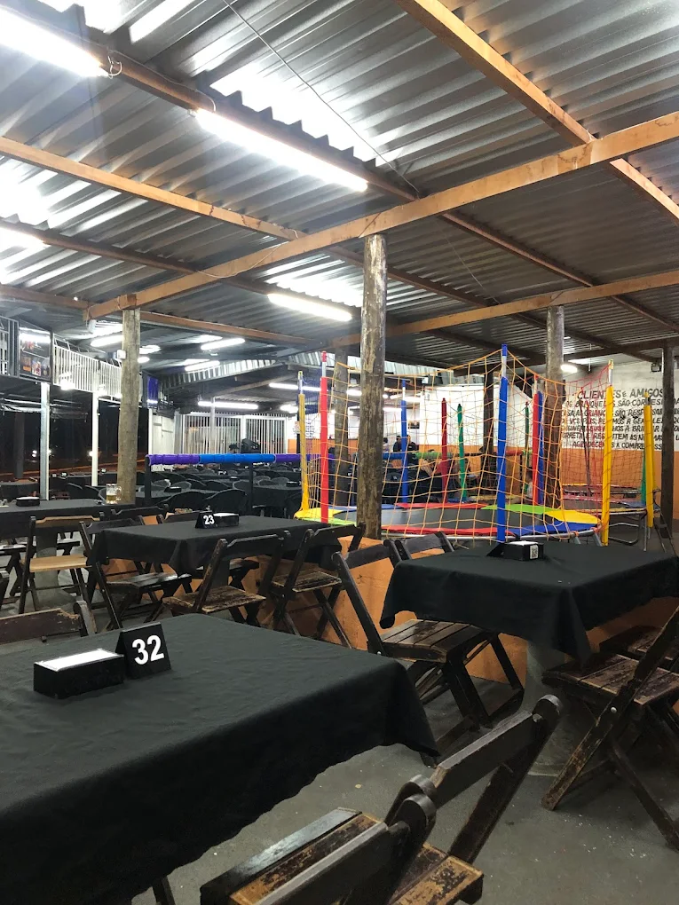

# Montanha Lanches

Landing page do Montanha Lanches, criada para divulgar cardapio, horarios e localizacao de forma simples e rapida.

## Conteudo
- Hero com chamada principal
- Secao de menu/cardapio
- Horarios de funcionamento
- Sobre o negocio
- Mapa/contato

## Capturas de tela
| Home | Foto Interior | Outro Interior |
| --- | --- | --- |
|  | .webp) | .webp) |

## Como rodar localmente
1. Tenha Node.js instalado
2. npm install
3. npm run dev
4. Acesse http://localhost:3000

## Estrutura do projeto
- index.html: pagina principal
- montanha-lanches.html: versao alternativa
- assets/: imagens e arquivos estaticos
- components/: prototipo em React/TSX das secoes

## Personalizacao rapida
Edite textos, precos e imagens direto nos arquivos HTML ou em assets/.

## Licenca
ISC
